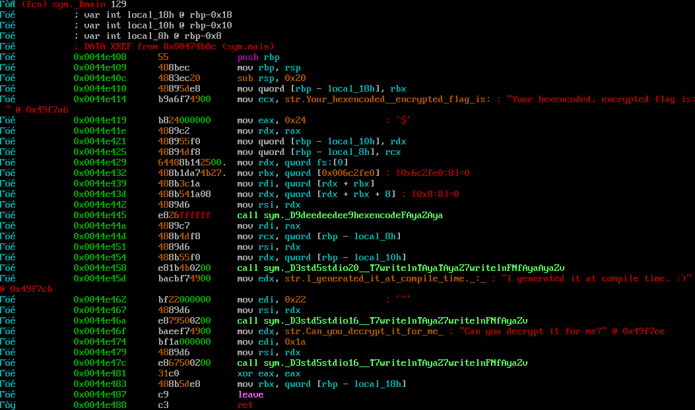
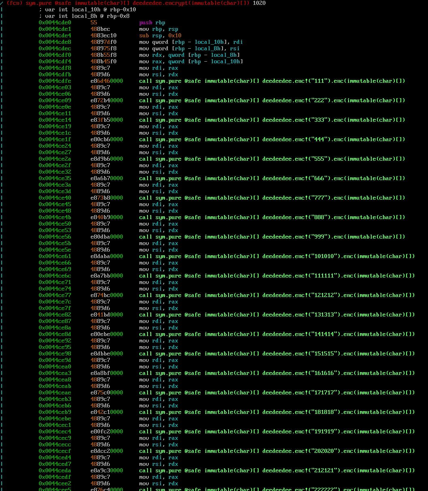

# CSAW CTF 2016 deedeedee (150) Writeup

> Wow! I can run code at compile time! That's a pretty cool way to keep my flags secret. Hopefully I didn't leave any clues behind...

This challenge uses a program which was most probably written in [D](https://en.wikipedia.org/wiki/D_(programming_language)).

As the description suggests, the program itself just prints a "encrypted" flag whilst the "encryption" possibly was taking place at compile time:
```
676c60677a74326d716c6074325f6c6575347172316773616c6d686e665f68735e6773385e345e3377657379316e327d
```

After some looking around, I figured out that the main function of programs written in D seems to end up as a `_Dmain` symbol.



As neither radare2 nor IDA Pro where able to demangle D function names, I've written a small D program which reads strings from stdin and demangles them if possible:

```d
import core.stdc.stdio : stdin;
import std.stdio;
import std.ascii;
import std.demangle;

int main()
{
    string buffer;
    bool inword;
    int c;

    while ((c = fgetc(stdin)) != EOF)
    {
        if (inword)
        {
            if (c == '_' || isAlphaNum(c))
                buffer ~= cast(char) c;
            else
            {
                inword = false;
                write(demangle(buffer), cast(char) c);
            }
        }
        else
        {   if (c == '_' || isAlpha(c))
            {
                inword = true;
                buffer.length = 0;
                buffer ~= cast(char) c;
            }
            else
                write(cast(char) c);
        }
    }
    if (inword)
        write(demangle(buffer));
    return 0;
}
```

This produces for example the following output:
```bash
$ ./demangle_names
_D9deedeedee9hexencodeFAyaZAya
immutable(char)[] deedeedee.hexencode(immutable(char)[])
```

In the next step, I searched for functions which contain `deedeedee` in their names. This results in a lot of functions with similar names:
```
> afl~deedeedee
0x0044cde0    1 1020         sym._D9deedeedee7encryptFNaNfAyaZAya
0x0044e370    4 148          sym._D9deedeedee9hexencodeFAyaZAya
0x00451470    4 213          sym._D9deedeedee21__T3encVAyaa3_313131Z3encFNaNfAyaZAya
0x00458280    4 213          sym._D9deedeedee21__T3encVAyaa3_323232Z3encFNaNfAyaZAya
0x00458358    4 213          sym._D9deedeedee21__T3encVAyaa3_333333Z3encFNaNfAyaZAya
0x00458430    4 213          sym._D9deedeedee21__T3encVAyaa3_343434Z3encFNaNfAyaZAya
0x00458508    4 213          sym._D9deedeedee21__T3encVAyaa3_353535Z3encFNaNfAyaZAya
0x004585e0    4 213          sym._D9deedeedee21__T3encVAyaa3_363636Z3encFNaNfAyaZAya
0x004586b8    4 213          sym._D9deedeedee21__T3encVAyaa3_373737Z3encFNaNfAyaZAya
0x00458790    4 213          sym._D9deedeedee21__T3encVAyaa3_383838Z3encFNaNfAyaZAya
0x00458868    4 213          sym._D9deedeedee21__T3encVAyaa3_393939Z3encFNaNfAyaZAya
0x00458940    4 213          sym._D9deedeedee27__T3encVAyaa6_313031303130Z3encFNaNfAyaZAya
0x00458a18    4 213          sym._D9deedeedee27__T3encVAyaa6_313131313131Z3encFNaNfAyaZAya
[...]
0x00471f18    4 213          sym._D9deedeedee33__T3encVAyaa9_343931343931343931Z3encFNaNfAyaZAya
0x00471ff0    4 213          sym._D9deedeedee33__T3encVAyaa9_343932343932343932Z3encFNaNfAyaZAya
0x0
04720c8    4 213          sym._D9deedeedee33__T3encVAyaa9_343933343933343933Z3encFNaNfAyaZAya
0x004721a0    4 213          sym._D9deedeedee33__T3encVAyaa9_343934343934343934Z3encFNaNfAyaZAya
0x00472278    4 213          sym._D9deedeedee33__T3encVAyaa9_343935343935343935Z3encFNaNfAyaZAya
0x00472350    4 213          sym._D9deedeedee33__T3encVAyaa9_343936343936343936Z3encFNaNfAyaZAya
0x00472428    4 213          sym._D9deedeedee33__T3encVAyaa9_343937343937343937Z3encFNaNfAyaZAya
0x00472500    4 213          sym._D9deedeedee33__T3encVAyaa9_343938343938343938Z3encFNaNfAyaZAya
0x004725d8    4 213          sym._D9deedeedee33__T3encVAyaa9_343939343939343939Z3encFNaNfAyaZAya
0x00474a90    1 40           sym._D9deedeedee7__arrayZ
0x00474ab8    1 79           sym._D9deedeedee8__assertFiZv
```

Demangling them shows:

```
> afl~deedeedee[3] | ./demangle_names
sym.pure @safe immutable(char)[] deedeedee.encrypt(immutable(char)[])
sym.immutable(char)[] deedeedee.hexencode(immutable(char)[])
sym.pure @safe immutable(char)[] deedeedee.enc!("111").enc(immutable(char)[])
sym.pure @safe immutable(char)[] deedeedee.enc!("222").enc(immutable(char)[])
sym.pure @safe immutable(char)[] deedeedee.enc!("333").enc(immutable(char)[])
sym.pure @safe immutable(char)[] deedeedee.enc!("444").enc(immutable(char)[])
sym.pure @safe immutable(char)[] deedeedee.enc!("555").enc(immutable(char)[])
sym.pure @safe immutable(char)[] deedeedee.enc!("666").enc(immutable(char)[])
sym.pure @safe immutable(char)[] deedeedee.enc!("777").enc(immutable(char)[])
sym.pure @safe immutable(char)[] deedeedee.enc!("888").enc(immutable(char)[])
sym.pure @safe immutable(char)[] deedeedee.enc!("999").enc(immutable(char)[])
sym.pure @safe immutable(char)[] deedeedee.enc!("101010").enc(immutable(char)[])
sym.pure @safe immutable(char)[] deedeedee.enc!("111111").enc(immutable(char)[])
sym.pure @safe immutable(char)[] deedeedee.enc!("121212").enc(immutable(char)[])
sym.pure @safe immutable(char)[] deedeedee.enc!("131313").enc(immutable(char)[])
sym.pure @safe immutable(char)[] deedeedee.enc!("141414").enc(immutable(char)[])
sym.pure @safe immutable(char)[] deedeedee.enc!("151515").enc(immutable(char)[])
sym.pure @safe immutable(char)[] deedeedee.enc!("161616").enc(immutable(char)[])
sym.pure @safe immutable(char)[] deedeedee.enc!("171717").enc(immutable(char)[])
sym.pure @safe immutable(char)[] deedeedee.enc!("181818").enc(immutable(char)[])
sym.pure @safe immutable(char)[] deedeedee.enc!("191919").enc(immutable(char)[])
[...]
sym.pure @safe immutable(char)[] deedeedee.enc!("485485485").enc(immutable(char)[])
sym.pure @safe immutable(char)[] deedeedee.enc!("486486486").enc(immutable(char)[])
sym.pure @safe immutable(char)[] deedeedee.enc!("487487487").enc(immutable(char)[])
sym.pure @safe immutable(char)[] deedeedee.enc!("488488488").enc(immutable(char)[])
sym.pure @safe immutable(char)[] deedeedee.enc!("489489489").enc(immutable(char)[])
sym.pure @safe immutable(char)[] deedeedee.enc!("490490490").enc(immutable(char)[])
sym.pure @safe immutable(char)[] deedeedee.enc!("491491491").enc(immutable(char)[])
sym.pure @safe immutable(char)[] deedeedee.enc!("492492492").enc(immutable(char)[])
sym.pure @safe immutable(char)[] deedeedee.enc!("493493493").enc(immutable(char)[])
sym.pure @safe immutable(char)[] deedeedee.enc!("494494494").enc(immutable(char)[])
sym.pure @safe immutable(char)[] deedeedee.enc!("495495495").enc(immutable(char)[])
sym.pure @safe immutable(char)[] deedeedee.enc!("496496496").enc(immutable(char)[])
sym.pure @safe immutable(char)[] deedeedee.enc!("497497497").enc(immutable(char)[])
sym.pure @safe immutable(char)[] deedeedee.enc!("498498498").enc(immutable(char)[])
sym.pure @safe immutable(char)[] deedeedee.enc!("499499499").enc(immutable(char)[])
sym.deedeedee.__array
sym.void deedeedee.__assert(int)
```

It seemed that these functions are used to encrypt the flag. That's why I was looking if these functions are used somewhere in the binary:

```
> axt @ sym._D9deedeedee21__T3encVAyaa3_313131Z3encFNaNfAyaZAya
call 0x44cdfe call sym._D9deedeedee21__T3encVAyaa3_313131Z3encFNaNfAyaZAya in sym._D9deedeedee7encryptFNaNfAyaZAya
> axt @ sym._D9deedeedee21__T3encVAyaa3_313131Z3encFNaNfAyaZAya | ./demangle_names
call 0x44cdfe call sym.pure @safe immutable(char)[] deedeedee.enc!("111").enc(immutable(char)[]) in sym.pure @safe immutable(char)[] deedeedee.encrypt(immutable(char)[])
```

Ok, so there is a encrypt function...
```
> pdf | ./demangle_names
```


This function calls the `enc` functions with incrementing number strings ("111", "222", "333", ..., "498498498", "499499499").

If we look at the content the `enc` functions, we'll see that they are all identical, except of using a different string ("111", "222", etc.). Based on the demangled names, I was able to decompile them approximately as follows:

```d
char[] enc(char[] data, string base) {
    auto len = cast(char) to!int(base.length);

    auto c = cycle(base);
    char[] res;
    foreach (tup; zip(c, data))
    {
        res ~= tup[0] ^ tup[1] ^ len;
    }
    return res;
}
```

By reversing the function calls, I was able to "decrypt" the flag:
```d
import std.range : cycle, zip;
import std.conv : to, hexString;
import std.stdio;

char[] enc(char[] data, string base) {
    auto len = cast(char) to!int(base.length);

    auto c = cycle(base);
    char[] res;
    foreach (tup; zip(c, data))
    {
        res ~= tup[0] ^ tup[1] ^ len;
    }
    return res;
}

int main() {

    auto data = hexString!"676c60677a74326d716c6074325f6c6575347172316773616c6d686e665f68735e6773385e345e3377657379316e327d";
    char[] res = data.dup;

    for (int i = 499; i >= 0; --i) {
        string base = to!string(i);
        res = enc(res, base ~ base ~ base);
    }

    writeln(res);
    return 0;
}
```
```
flag{t3mplat3_met4pr0gramming_is_gr8_4_3very0n3}
```
